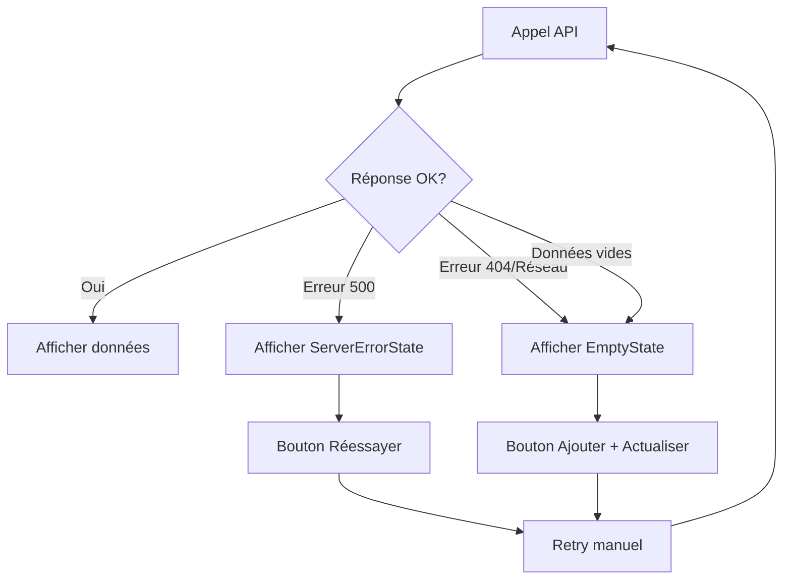

# Gestion des Erreurs - Frontend

## 🎯 Objectif

Gérer gracieusement les erreurs API (404, 500, réseau) dans l'application frontend pour offrir une expérience utilisateur fluide même lorsque le backend est indisponible.

## 🛠️ Implémentation

### 1. Hook `useMembers` Amélioré

```typescript
const {
  data: response,
  isLoading,
  isError,
  error,
  refetch,
  isEmpty,          // ✅ Nouveau: true si aucune donnée
  isServerError,    // ✅ Nouveau: true si erreur 500
} = useMembers({ page, pageSize });
```

### 2. Comportements par Type d'Erreur

#### **🔴 Erreur 500 (Internal Server Error)**
- **Affiche**: `ServerErrorState` avec message "Serveur indisponible"
- **Action**: Bouton "Réessayer" pour retry manuel
- **Pas de retry automatique**

#### **🟡 Erreur 404 / Réseau**
- **Affiche**: `MembersEmptyState` avec message "Aucun membre pour le moment"
- **Action**: Bouton "Ajouter un membre" + "Actualiser"
- **Retry automatique**: 2 tentatives avec délai exponentiel

#### **⚪ Données Vides**
- **Affiche**: `MembersEmptyState` avec message "Aucun membre pour le moment"
- **Action**: Bouton "Ajouter un membre"

### 3. Composants d'Erreur

#### **`EmptyState`**
```typescript
<EmptyState
  type="members"
  title="Aucun membre pour le moment"
  description="Commencez par ajouter votre premier membre"
  action={{ label: "Ajouter un membre", onClick: handleCreate }}
  onRetry={handleRetry}
  isRetrying={isLoading}
/>
```

#### **`ServerErrorState`**
```typescript
<ServerErrorState
  onRetry={handleRetry}
  isRetrying={isLoading}
/>
```

#### **`ApiError`**
```typescript
<ApiError
  type="server"        // 'network' | 'server' | 'validation' | 'general'
  error={errorMessage}
  onRetry={handleRetry}
  isRetrying={isLoading}
/>
```

## 🔄 Flux de Gestion des Erreurs



## 🎨 Messages Utilisateur

### **Serveur indisponible (500)**
> "Le serveur rencontre des difficultés techniques. Veuillez réessayer dans quelques instants."

### **Aucun membre (404/Vide)**
> "Aucun membre pour le moment. Commencez par ajouter votre premier membre à la coopérative."

### **Problème de connexion**
> "Erreur de connexion. Vérifiez votre connexion internet."

## 🚀 Utilisation dans les Composants

### **Exemple - MembersTable**
```typescript
export default function MembersTable({ onActionClick, onCreateMember }) {
  const { isLoading, isError, refetch, isEmpty, isServerError } = useMembers();

  if (isLoading) return <LoadingSkeleton />;
  
  if (isServerError) {
    return <ServerErrorState onRetry={refetch} isRetrying={isLoading} />;
  }

  if (isError || isEmpty) {
    return <MembersEmptyState onCreateMember={onCreateMember} onRetry={refetch} />;
  }

  return <TableWithMembers />;
}
```

## 🛡️ Sécurité & Performance

- **Pas d'exposition** des erreurs techniques brutes à l'utilisateur
- **Retry intelligent** avec délai exponentiel (max 30s)
- **Cache optimisé** (5min pour les membres)
- **Pas de refetch** automatique au focus de la fenêtre
- **Fallback automatique** pour la génération de numéros de compte

## 📝 Bonnes Pratiques

1. **Toujours utiliser** les états `isEmpty` et `isServerError`
2. **Fournir une action** (retry ou création) dans tous les états d'erreur
3. **Utiliser les composants** `EmptyState` et `ServerErrorState` pour la cohérence
4. **Éviter les retries** automatiques pour les erreurs 500
5. **Logger les erreurs** en console pour le débogage

## 🔄 Extensibilité

Pour ajouter cette gestion d'erreurs à d'autres hooks :

```typescript
// Copier le pattern de useMembers
export const useSavings = (params) => {
  const query = useQuery({
    queryKey: ['savings', params],
    queryFn: () => fetchSavings(params),
    retry: (failureCount, error) => {
      if (error.message.includes('Erreur serveur')) return false;
      return failureCount < 2;
    },
    // ... autres options
  });

  return {
    ...query,
    isEmpty: !query.isLoading && !query.isError && query.data?.data.length === 0,
    isServerError: query.isError && query.error?.message.includes('Erreur serveur'),
  };
};
```
